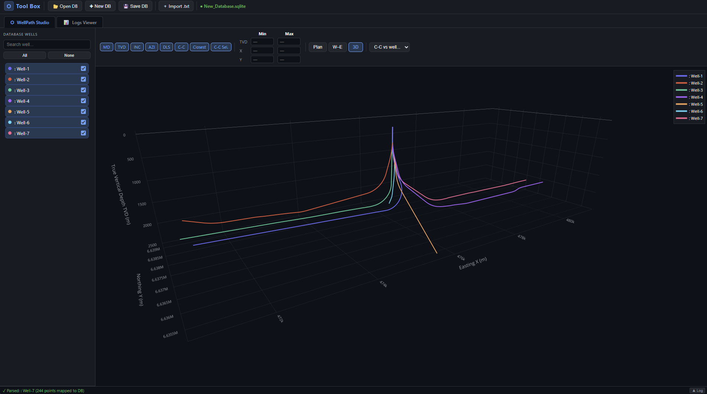
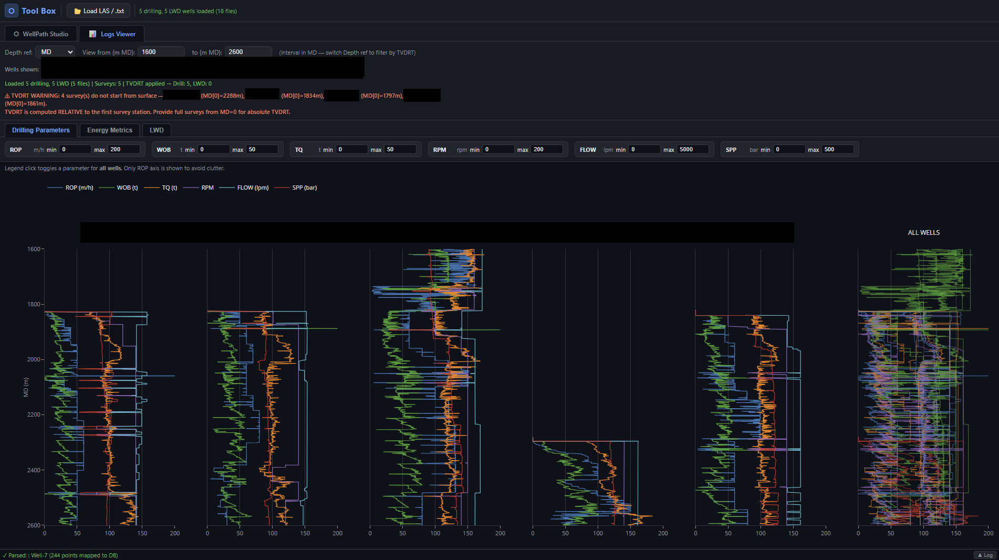

# Tool Box

A professional, high-performance web-based toolkit designed for drilling engineers,
operations geologists and wellsite geologists to manage well trajectories
and analyze drilling parameters, LWD and gas data.
This suite provides integrated modules for 3D visualization,
comparative multi well-paths and data analysis,
Furthermore, an additional module for gas data analysis
will be implemented in future versions.

## Key Features

* **WellPath Studio**: Advanced 3D trajectory visualization and spatial analysis using SQLite for robust data handling.
* **Logs Viewer**: Efficient multi-file loading (.LAS/.txt) with customizable track overlays and interactive plotting.
* **Reactive Engine**: Real-time filtering and database management optimized for local processing.

## Status: Under Construction

**Note**: This project is currently in active development. While the core WellPath
and Log viewing modules are functional,
we are continuously improving stability and performance.

**Upcoming Module**: 
We are currently working on a new **Gas Data Analysis Module**. This module will feature
specialized algorithms for gas reading interpretation, chromatography and signatures plotting,
and real-time gas trend analysis during drilling operations.

---

## Technical Stack
* **Plotly.js**: For high-fidelity data visualization.
* **sql.js (WASM)**: For in-browser relational database management.
* **Three.js**: Integrated for advanced 3D spatial rendering.

## Usage
1. Open the application in your browser.
2. Load your database or drag & drop drilling files (.LAS, .txt) into the interface.
3. Use the toggle bars to filter and analyze specific datasets.
